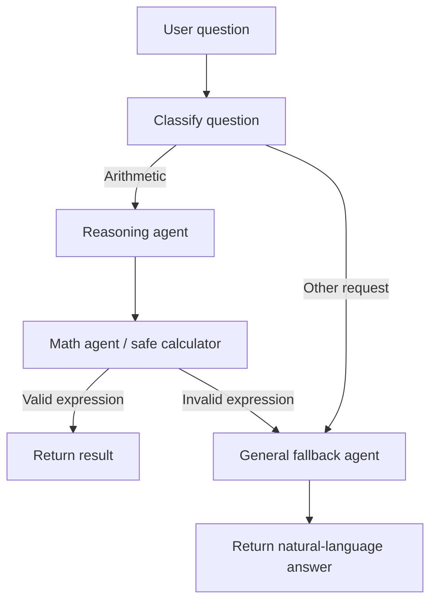

# Tool-Using Agentic AI Workflow

A two-agent LangGraph workflow with a general-question fallback and a Streamlit chat interface. Arithmetic questions are converted into expressions and evaluated by a restricted calculator; definitions and other non-arithmetic questions are answered by a general-response agent.

## Features

- Routes numeric arithmetic questions to a reasoning agent and calculator.
- Routes definitions, explanations, and other requests to a general-response fallback.
- Falls back to a general response if an arithmetic expression cannot be safely evaluated.
- Provides a Streamlit chat UI with conversation history and a clear button.
- Evaluates arithmetic with a restricted AST evaluator instead of Python `eval`.

## Requirements

- Python 3.10 or newer
- An OpenAI API key for live model requests

## Setup

From the repository root, create and activate a virtual environment, then install dependencies:

```powershell
python -m venv .venv
.\.venv\Scripts\Activate.ps1
python -m pip install -r requirements.txt
```

Create a `.env` file in the repository root and add your API key:

```text
OPENAI_API_KEY=your_api_key_here
```

The `.env` file is ignored by Git. Do not commit API keys or other secrets.

## Run the app

```powershell
streamlit run app.py
```

Enter a question in the chat box. For example:

- `What is the square of the average of 10 and 5?`
- `Define AI`

## Workflow



The classifier routes arithmetic requests through the existing reasoning and math agents. All other requests go directly to the general fallback agent. If a request is classified as arithmetic but the generated expression is invalid or unsupported, the workflow also routes to the fallback instead of raising an evaluation error.

## Run tests

The unit tests mock model responses, so they do not need an API key:

```powershell
python -m unittest discover -s tests -v
```

The tests cover arithmetic evaluation, rejection of executable Python, arithmetic routing, general-question routing, and fallback after an invalid expression.

## Project layout

```text
app.py                       Streamlit chat interface
config/llm.py                OpenAI chat model setup
pattern/tool_using/graph.py  LangGraph routing and workflow
pattern/tool_using/nodes.py  Classifier, reasoning, math, and fallback nodes
tools/calculator.py          Restricted arithmetic evaluator
tests/test_workflow.py       Mocked workflow and calculator tests
requirements.txt             Python dependencies
```
