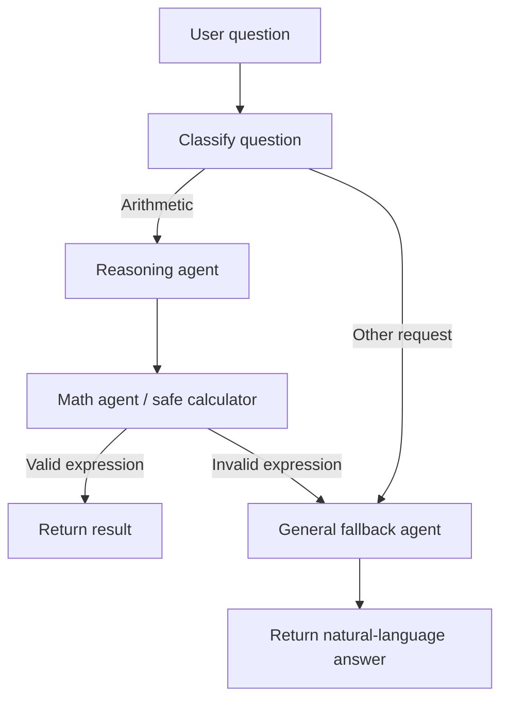
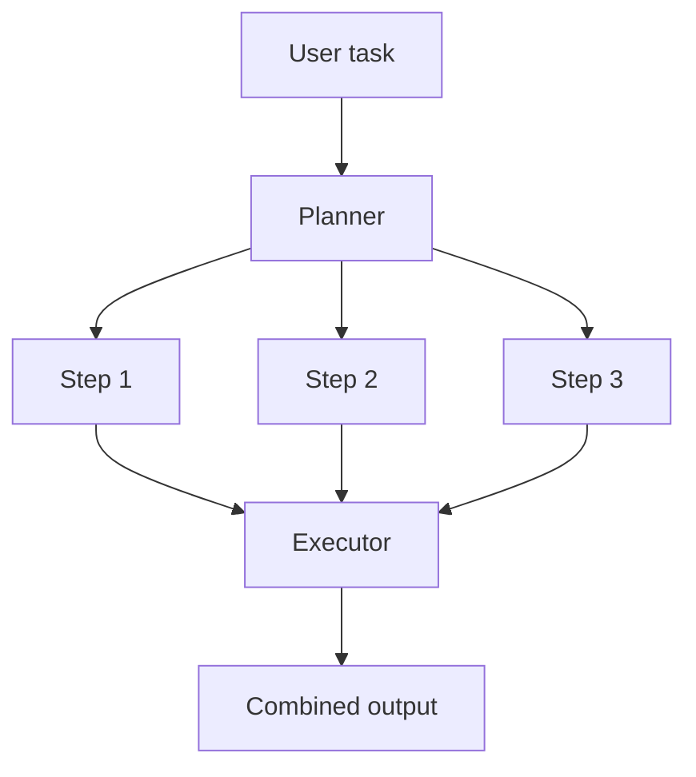

# Agentic AI Design Patterns

Demonstrations of three LangGraph workflows in one Streamlit app: a tool-using agent, a planner-executor agent, and a supervisor-worker agent.

## Features

- Routes numeric arithmetic questions to a reasoning agent and calculator.
- Routes definitions, explanations, and other requests to a general-response fallback.
- Falls back to a general response if an arithmetic expression cannot be safely evaluated.
- Provides a Streamlit chat UI with conversation history and a clear button.
- Evaluates arithmetic with a restricted AST evaluator instead of Python `eval`.
- Demonstrates planner-executor orchestration: create a short plan, execute each step, and present both in the chat.
- Demonstrates supervisor-worker routing between a math worker and a leave-balance worker.
- Keeps each demonstration's chat history separate when switching patterns.

## Requirements

- Python 3.10 or newer
- An OpenAI API key for live model requests

## Setup

From the repository root, create and activate a virtual environment, then install dependencies:

```powershell
python -m venv .venv
.\.venv\Scripts\Activate.ps1
python -m pip install -r requirements.txt
```

Create a `.env` file in the repository root and add your API key:

```text
OPENAI_API_KEY=your_api_key_here
```

The `.env` file is ignored by Git. Do not commit API keys or other secrets.

## Run the app

```powershell
streamlit run app.py
```

Choose a demonstration in the sidebar, then enter a request in the chat box.

Tool-using examples:

- `What is the square of the average of 10 and 5?`
- `Define AI`

Planner-executor example:

- `Create a simple 3-step plan for launching an AI chatbot product.`

Supervisor-worker examples:

- `What is the square of the average of 10 and 5?`
- `What is the leave balance for Alice?`

## Workflow



The classifier routes arithmetic requests through the existing reasoning and math agents. All other requests go directly to the general fallback agent. If a request is classified as arithmetic but the generated expression is invalid or unsupported, the workflow also routes to the fallback instead of raising an evaluation error.

### Planner-executor

The planner creates up to three actionable steps. The executor sends each step to the model and combines the results. The Streamlit page displays the plan and execution output separately.



	### Supervisor-worker

	The supervisor classifies a request as either `math` or `leave`. The graph routes the request to the corresponding worker, and the UI displays the selected worker and its result. The included leave-balance lookup contains demo values for Alice, Bob, and Carol; it is sample data, not a real HR system.

	```mermaid
	flowchart TD
		A[User query] --> B[Supervisor]
		B -->|math| C[Math worker]
		B -->|leave| D[Leave worker]
		C --> E[Safe calculator]
		D --> F[Demo leave-balance lookup]
		E --> G[Show selected worker and result]
		F --> G
	```

## Run tests

The unit tests mock model responses, so they do not need an API key:

```powershell
python -m unittest discover -s tests -v
```

The tests cover arithmetic evaluation, rejection of executable Python, arithmetic routing, general-question routing, and fallback after an invalid expression.

## Project layout

```text
app.py                       Streamlit chat interface
config/llm.py                OpenAI chat model setup
pattern/tool_using/graph.py  LangGraph routing and workflow
pattern/tool_using/nodes.py  Classifier, reasoning, math, and fallback nodes
pattern/planner_executor/    Planner-executor graph, nodes, and state
pattern/supervisor_worker/  Supervisor-worker graph, nodes, and state
tools/calculator.py          Restricted arithmetic evaluator
tools/leaves_db.py           Sample leave balances for the demo
tests/                       Mocked workflow and calculator tests
requirements.txt             Python dependencies
```
